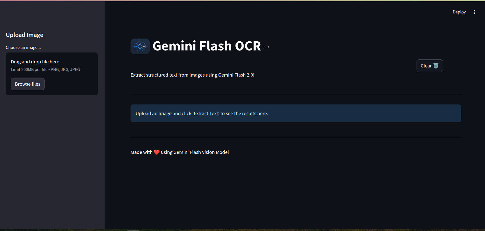
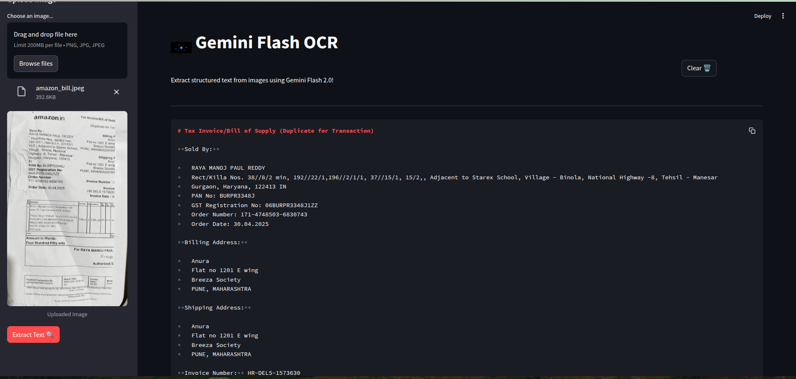

# OCR App

This project leverages Gemma-3 vision capabilities and Streamlit to create a 100% locally running computer vision app that can perform both OCR and extract structured text from the image.
# Method 1:
## Installation and setup

**Setup Ollama**:
   ```bash
   # setup ollama on linux 
   curl -fsSL https://ollama.com/install.sh | sh
   # pull gemma-3 vision model
   ollama run gemma3:12b
   ```

**Install Dependencies**:
   Ensure you have Python 3.11 or later installed.
   ```bash
   pip install streamlit ollama pillow
   ```

## Run File
```bash
streamlit run app.py
```

# Method 2:
## Installation and setup

**Setup API key**:
set your gemini-2.0-flash api key in .env file.

**Install Dependencies**:
Ensure you have Python 3.10 or later installed.
```bash
   pip install requirements.txt
   ```
## Run File
```bash
streamlit run main.py
```




## Contribution

Contributions are welcome! Please fork the repository and submit a pull request with your improvements.
